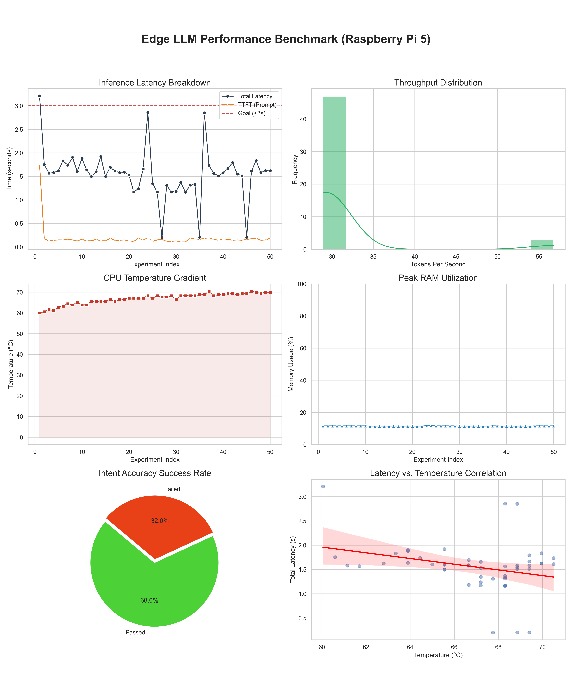

# Edge LLM Hardware Controller

A Raspberry Pi 5 based middleware that enables natural language control of physical hardware (RGB LED, Buzzer) using a local Large Language Model (**Qwen2.5-0.5B-Instruct**).

---

## 1. Configuration & Running Guide

### Hardware Requirements
- **Raspberry Pi 5** (8GB recommended)
- **Active Cooler** (Essential for thermal management during inference)
- **64GB+ MicroSD Card**
- **RGB LED** (Common Cathode or Anode)
- **Passive Buzzer**
- **Resistors** (220Ω for RGB channels)
- **Solderless Breadboard** and jumper wires

### OS Installation & Connectivity
1. **Physical Setup**: Attach the **Official Active Cooler** to the Raspberry Pi 5. This is critical to maintain performance during continuous LLM inference.
2. **Flash OS**: Use **Raspberry Pi Imager** to write **Raspberry Pi OS Lite (64-bit)** onto the microSD card. 
3. **Initial Configuration**: 
   - In the Imager's "OS Customization" settings, enable **SSH** and configure your **WiFi** credentials.
   - Insert the flashed microSD card into the Pi and power it up.
4. **Access**: Connect to the device via SSH from your computer:
   ```bash
   ssh <username>@<hostname>.local
   ```

### Breadboard Wiring Diagram
| Component   | Device Pin   | Pi GPIO | Physical Pin | Resistor |
| :---------- | :----------- | :------ | :----------- | :------- |
| **RGB LED** | Red (R)      | GPIO 17 | Pin 11       | 220Ω     |
| **RGB LED** | Green (G)    | GPIO 27 | Pin 13       | 220Ω     |
| **RGB LED** | Blue (B)     | GPIO 22 | Pin 15       | 220Ω     |
| **RGB LED** | Common       | GND     | Pin 6/9      | None     |
| **Buzzer**  | Positive (+) | GPIO 23 | Pin 16       | None     |
| **Buzzer**  | Negative (-) | GND     | Pin 14/20    | None     |

### Software Setup
1. **Initialize Environment**:
   ```bash
   pip install gpiozero requests
   ```
2. **Setup Inference Engine**:
   Install `llama.cpp` and ensure `llama-server` is built.
3. **Download Model**:
   Place `qwen2.5-0.5b-instruct-q4_k_m.gguf` in your desired directory.

### Running the System
1. **Verify Connections**:
   ```bash
   python3 test_hardware.py
   ```
2. **Start Local LLM Server**:
   ```bash
   ~/llama.cpp/build/bin/llama-server -m ~/llama.cpp/qwen2.5-0.5b-instruct-q4_k_m.gguf --port 8080 &
   ```
3. **Run Application**:
   ```bash
   python3 main.py
   ```

---

## 2. System Design and Implementation

### Project Architecture
The system is designed as a modular pipeline that bridges high-level natural language understanding with low-level electronic control:

- **Local Inference Engine (`llama.cpp`)**: Runs completely offline on the Raspberry Pi 5 CPU. It utilizes ARM NEON acceleration and 4-bit quantization (GGUF) to maintain interactive speeds without a dedicated GPU.
- **Middleware Controller (Python)**: Acts as the "Brain." It manages the communication between the user and the LLM. It wraps user inputs into a structured System Prompt that defines the hardware's capabilities and constraints.
- **Structured Intent Extraction**: The system uses **JSON Prompting** to force the LLM to output precise commands. This eliminates the need for secondary NLU parsers, as the LLM directly "reasons" about which hardware function to call.
- **Hardware Abstraction Layer (`gpiozero`)**: Provides a clean Python interface to the Raspberry Pi's GPIO pins, handling PWM for LED color mixing and digital output for the buzzer.

### Implementation Details
- **Quantization Strategy**: Q4_K_M was selected to balance inference speed (Tokens/s) with the accuracy of JSON generation.
- **Prompt Engineering**: Uses the ChatML format with a strict role definition to minimize hallucinations and ensure output valid for `json.loads()`.
- **System Robustness**: Includes a regex-based JSON extractor in `llm_interface.py` to handle potential verbose text generated by the model before/after the JSON block.

---

## 3. Benchmark Results

The system's performance was evaluated through a specialized benchmarking suite (`benchmark.py`) that measures latency, throughput, and hardware resource utilization.

### Evaluation Metrics
- **TTFT (Time To First Token)**: Average latency for the model to begin generating a response (Prompt processing).
- **Throughput**: Generation speed measured in Tokens Per Second.
- **Resource Footprint**: RAM usage and CPU temperature during peak inference.
- **Mapping Accuracy**: The percentage of successful intent-to-JSON mappings for various command types.

### Performance Summary
The following chart summarizes the benchmark results for the Qwen-0.5B model on the Raspberry Pi 5:



*Detailed performance logs are available in `benchmark_log.json`.*

---

## 4. Statement of Work

All architecture design, hardware setup, implementation, and performance evaluation were performed independently by **Haochen Zhao** with the assistance of AI tools. 
